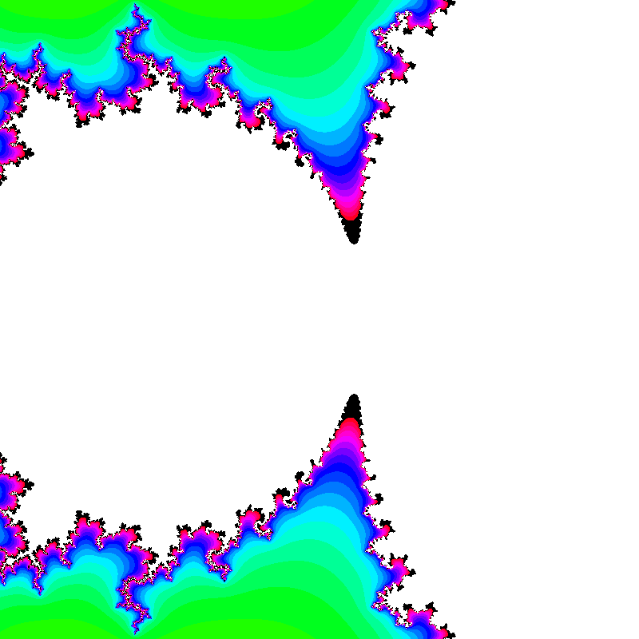
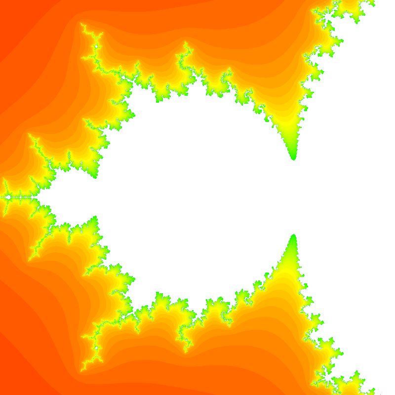
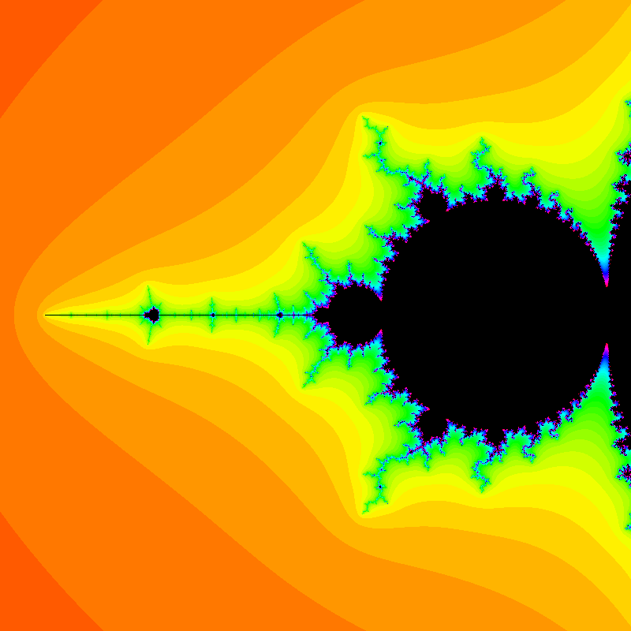
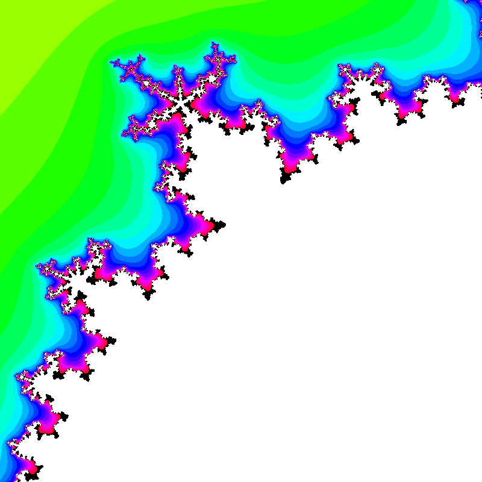

# CPPND-Capstone: Fractal-Creator 

This is my repo for the Capstone project in the [Udacity C++ Nanodegree Program](https://www.udacity.com/course/c-plus-plus-nanodegree--nd213).

## Dependencies for Running Locally
* cmake >= 3.7
  * All OSes: [click here for installation instructions](https://cmake.org/install/)
* make >= 4.1 (Linux, Mac), 3.81 (Windows)
  * Linux: make is installed by default on most Linux distros
  * Mac: [install Xcode command line tools to get make](https://developer.apple.com/xcode/features/)
  * Windows: [Click here for installation instructions](http://gnuwin32.sourceforge.net/packages/make.htm)
* gcc/g++ >= 5.4
  * Linux: gcc / g++ is installed by default on most Linux distros
  * Mac: same deal as make - [install Xcode command line tools](https://developer.apple.com/xcode/features/)
  * Windows: recommend using [MinGW](http://www.mingw.org/)

Optional: `clang-format -style=Google src/* -i` 

## Basic Build Instructions

1. Clone this repo.
2. Make a build directory in the top level directory: `mkdir build && cd build`
3. Compile: `cmake .. && make`
4. Run it: `./fractal-creator`.
  Expected output of build `./fractal-creator`:   
  `file with zoom: 100% written in 7614ms`
5. Options are width, height, zoom, iterations
  `./fractal-creator --iterations 99` 

## Criteria 	Meets Specifications

### README (All Rubric Points REQUIRED)

- [x]  A README with instructions is included with the project
- [x]  The README indicates which project is chosen.
- [x]  The README includes information about each rubric point addressed.
- [x]  The README indicates which rubric points are addressed. 

### Compiling and Testing (All Rubric Points REQUIRED)

- [x]  The submission must compile and run.

### Loops, Functions, I/O

- [x]  The project demonstrates an understanding of C++ functions and control structures.
- [x]  The project reads data from a file and process the data, or the program writes data to a file.
  Writes to File, see Image Implentation
- [x]  The project accepts user input and processes the input.
  see main.cpp input options as arguments, `AbstractImage::render()` outputs ppm  

### Object Oriented Programming

- [x]  The project uses Object Oriented Programming techniques.
- [x]  Classes use appropriate access specifiers for class members.
- [x]  Class constructors utilize member initialization lists.
  see prof_timer.cpp  
- [x]  Classes abstract implementation details from their interfaces.
- [x]  Classes encapsulate behavior.
- [x]  Classes follow an appropriate inheritance hierarchy.
  AbstractImage as parent or BaseClass of MandelbrotImage  
- [x]  Overloaded functions allow the same function to operate on different parameters.	
- [x]  Derived class functions override virtual base class functions.
  see Image Implentation

### Concurrency

- [x]  A promise and future is used in the project.
  see main.cpp
- [x]  A mutex or lock is used in the project.
  see main.cpp
